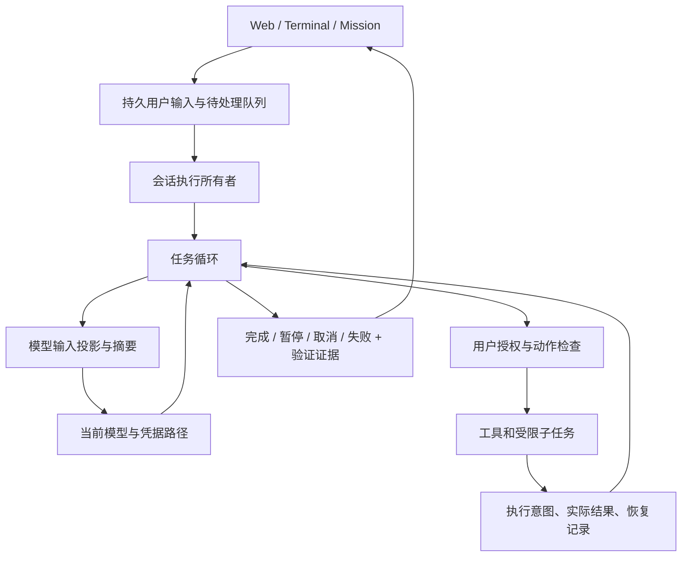

# Collie Agent Harness 源码对照与产品设计

本轮直接检出并阅读了 8 个代表性开源项目的执行代码。范围是会话循环、上下文、插话、取消、恢复、权限和子任务，不是整个市场的穷尽清单，也不把 README 的功能声明当成实现证据。下面的链接固定到本轮检出的 commit；结论描述该版本。参考项目更新后应重新核对。

## 1. 最影响体验的结论

**取消固定步数上限，只解决了长任务的一小部分。** Codex、OpenCode 和 Pi 的常规循环可以没有固定轮数上限；OpenHands、Hermes 和 Goose 则保留较高的可配置上限。这些实现共同关心的是：有无待处理输入、工具是否完成、上下文是否还能承载任务、预算是否耗尽，以及停止后能否恢复。不能只把 Collie 的数字从 40 改成另一个更大的数字。

**一次最终回复与一个产品目标完成，是两个层次。** 通用聊天循环通常在模型给出最终回复且没有待处理工作时结束。持续任务需要额外的任务状态、检查结果或用户选择的目标策略。用“让我检查一下”等文字猜测是否要强迫继续，容易误伤正常回答，且不适用于所有语言。

**真正的连续性是数据模型能力。** 用户的原始要求、运行中的工具、已执行的结果、尚未处理的插话、摘要和权限来源必须各有明确身份。把它们全部压成几条 `role=user` 文本，会让模型和界面都分不清谁提出了什么。

## 2. 源码比较

| 项目与固定版本 | 循环与停止 | 长上下文、恢复和子任务 | Collie 可采用的原则 |
| --- | --- | --- | --- |
| Codex `ac192cd7937b0d73edc6dffe009940ae53782dd4` | 常规回合根据工具后续工作和待处理输入继续；外层也会检查输入队列。[执行循环](https://github.com/openai/codex/blob/ac192cd7937b0d73edc6dffe009940ae53782dd4/codex-rs/core/src/session/turn.rs#L450)、[外层任务](https://github.com/openai/codex/blob/ac192cd7937b0d73edc6dffe009940ae53782dd4/codex-rs/core/src/tasks/regular.rs#L78) | 在回合前、回合中和模型切换时处理上下文；中断会写入历史标记并刷新记录，再通知客户端。[中断处理](https://github.com/openai/codex/blob/ac192cd7937b0d73edc6dffe009940ae53782dd4/codex-rs/core/src/tasks/mod.rs#L930) | 默认持续完成工作；停止状态和恢复记录要先一致，界面再显示结束。 |
| OpenCode `337fd144d2ba144743368f78d9579a99cce175bd` | 每轮重读已持久化消息；最终回复必须对应最新用户消息且没有活跃工具。未配置 `steps` 时使用 Infinity。[消息循环](https://github.com/anomalyco/opencode/blob/337fd144d2ba144743368f78d9579a99cce175bd/packages/opencode/src/session/prompt.ts#L1088) | 同一会话已有运行时，另一个调用等待已有运行；摘要是可追踪的会话工作。[运行所有权](https://github.com/anomalyco/opencode/blob/337fd144d2ba144743368f78d9579a99cce175bd/packages/opencode/src/effect/runner.ts#L115)、[摘要](https://github.com/anomalyco/opencode/blob/337fd144d2ba144743368f78d9579a99cce175bd/packages/opencode/src/session/compaction.ts#L559) | 一个会话只有一个执行者；插话先持久化，再由这个执行者消费。 |
| Pi `9767ba275f3e9a5ee0f5c5342249b629ab1b2282` | 分开处理正在工作时的 steering 和工作完成后的 follow-up；持久运行层要求每次状态推进确实有进展。[双队列](https://github.com/earendil-works/pi/blob/9767ba275f3e9a5ee0f5c5342249b629ab1b2282/packages/agent/src/agent-loop.ts#L156)、[状态推进](https://github.com/earendil-works/pi/blob/9767ba275f3e9a5ee0f5c5342249b629ab1b2282/packages/agent/src/harness/runtime/drive.ts#L48) | 执行前持久化工具意图；恢复重放要求记录和当前工具都声明 `replay=safe`，否则说明结果未知。[工具恢复](https://github.com/earendil-works/pi/blob/9767ba275f3e9a5ee0f5c5342249b629ab1b2282/packages/agent/src/harness/runtime/drive/tools.ts#L515) | 工具名称像“读取”不等于可以安全重放；取消不能把未知外部效果改写成失败或未执行。 |
| OpenHands SDK `8ea8e3bc1d5e84542f7702b8813734ef600c9fce` | 默认每次运行 500 次迭代，预算与卡住检测分别约束执行；有新消息时可从完成状态继续。[会话实现](https://github.com/OpenHands/software-agent-sdk/blob/8ea8e3bc1d5e84542f7702b8813734ef600c9fce/openhands-sdk/openhands/sdk/conversation/impl/local_conversation.py#L1936) | 上下文是经过约束验证的 View；切割要保持完整工具循环，取消后为没有结果的动作补上明确记录。[工具原子性](https://github.com/OpenHands/software-agent-sdk/blob/8ea8e3bc1d5e84542f7702b8813734ef600c9fce/openhands-sdk/openhands/sdk/context/view/properties/tool_loop_atomicity.py#L14) | 摘要有效性不能只看字符串长度；还要验证工具配对、最近请求和预算归属。 |
| Hermes `7166071fcaadb36df26f6d753dda97da6b5d699e` | 调用次数和 IterationBudget 共同约束；预算耗尽后有受控收尾路径，优先保留已有候选答复。[循环](https://github.com/NousResearch/hermes-agent/blob/7166071fcaadb36df26f6d753dda97da6b5d699e/agent/conversation_loop.py#L1479)、[收尾](https://github.com/NousResearch/hermes-agent/blob/7166071fcaadb36df26f6d753dda97da6b5d699e/agent/turn_finalizer.py#L119) | `content` 与发给模型的 `api_content` 分开；恢复时区分只读中断与可能产生效果的动作。[发送投影](https://github.com/NousResearch/hermes-agent/blob/7166071fcaadb36df26f6d753dda97da6b5d699e/agent/turn_context.py#L79)、[恢复清理](https://github.com/NousResearch/hermes-agent/blob/7166071fcaadb36df26f6d753dda97da6b5d699e/agent/replay_cleanup.py#L49) | 原始历史与模型输入分离；摘要要保留当前未完成请求，包括用户后来提出的停止或撤回。 |
| Goose `5e90925962f05acf8e255032de44d16c4a7768a2` | 默认路径有 1000 次可配置上限；空响应、输出截断、工具后续和最终回复分别处理。[默认执行器](https://github.com/aaif-goose/goose/blob/5e90925962f05acf8e255032de44d16c4a7768a2/crates/goose/src/agents/agent.rs#L3340) | 自动摘要会提取并重新附上最近的文本用户请求；子任务有独立会话，继承取消信号。[请求保留](https://github.com/aaif-goose/goose/blob/5e90925962f05acf8e255032de44d16c4a7768a2/crates/goose/src/context_mgmt/mod.rs#L96)、[子任务](https://github.com/aaif-goose/goose/blob/5e90925962f05acf8e255032de44d16c4a7768a2/crates/goose/src/agents/subagent_handler.rs#L186) | 当前请求应由宿主保留，不能只依赖摘要模型复述；界面不要把空输出算完成。 |
| Aider `5dc9490bb35f9729ef2c95d00a19ccd30c26339c` | 编辑格式和检查结果驱动反思循环，默认最多 3 次；它是专门的代码编辑流程，不能把这个数字等同于通用 agent 轮数。[反思循环](https://github.com/Aider-AI/aider/blob/5dc9490bb35f9729ef2c95d00a19ccd30c26339c/aider/coders/base_coder.py#L932) | 当前交换与历史分开；后台摘要完成后，只有源历史未改变才采纳。[摘要提交](https://github.com/Aider-AI/aider/blob/5dc9490bb35f9729ef2c95d00a19ccd30c26339c/aider/coders/base_coder.py#L1002) | 针对真实失败做有限修复；过期摘要应丢弃，不能覆盖新消息。 |
| Cline `dac3b35ba485dbab3b5a73aca239b0d07ce071cf` | 当前代码在 `sdk/packages`；运行时区分最终回复、工具后续、空输出、输出截断和 completion reminder。[执行器](https://github.com/cline/cline/blob/dac3b35ba485dbab3b5a73aca239b0d07ce071cf/sdk/packages/agents/src/agent-runtime.ts#L728) | basic 摘要优先完整保留用户输入；agentic 路径保护最近请求；预算投影按工具 ID 的关联闭包移除消息。[用户输入预算](https://github.com/cline/cline/blob/dac3b35ba485dbab3b5a73aca239b0d07ce071cf/sdk/packages/core/src/extensions/context/basic-compaction.ts#L472)、[工具关联](https://github.com/cline/cline/blob/dac3b35ba485dbab3b5a73aca239b0d07ce071cf/sdk/packages/core/src/extensions/context/budget-projection/project.ts#L600) | 不截断用户要求中间一段来凑摘要预算；模型消息角色和界面显示角色应分开。 |

说明：上述表格有意区分事实与迁移建议。某一参考实现的默认值不代表 Collie 应照搬，也不代表该项目所有入口行为相同。Hermes 的子代理使用独立迭代预算，Goose 的子代理继承较完整能力；Collie 本轮选择父子共享总预算和只读调查，这是不同的产品取舍。

## 3. Collie 的目标结构

这是职责划分，不要求一次性重写所有模块。先建立行为约束和真实场景验证，再把已有入口逐步收敛到共用实现，避免平行维护多套“差不多相同”的循环。

| 约束 | 产品上的含义 | 验收方式 |
| --- | --- | --- |
| 原始记录保持完整，摘要只是投影 | 回看、恢复、fork 和权限审计看到真实发生过的事 | 两次摘要、保存、进程重启后，原记录不丢、投影仍有效 |
| 当前用户要求完整保留 | 长任务不会把最后一句内部提醒当成新目标 | 长中文要求、中段约束、运行中纠正、图片反馈场景 |
| 每个工具调用有唯一对应的执行结果或中断说明 | 不出现无法恢复的半个工具批次 | 执行前、执行中、两工具之间分别中断 |
| 同一会话只有一个执行者 | 连点发送、两个窗口、重连不会重复修改项目 | 并发提交与进程退出后的所有权回收 |
| 已确认接收的输入先持久化 | 页面断开后插话仍在，不需要用户重新输入 | 发送插话后关闭客户端、重启后继续 |
| 模型、摘要、子任务共用实际资源计数 | 不因委派或重试绕过设置，也不重复统计子任务 | 父子调用、协议修复、摘要失败分别耗尽预算 |
| 停止状态和验证结果分开 | 只读回答不显示无意义的“未验证”；预算停止不冒充完成 | 阅读、编辑未检查、检查失败、取消和额度耗尽 |
| 恢复沿用会话工作目录 | 从不同终端打开同一会话仍操作同一个项目 | CLI / REPL / TUI 跨目录恢复和显式迁移 |

## 4. 本轮实施与后续取舍

这些原则已经落实为实际代码与回归，主要对应关系如下。具体实测和剩余限制见 [产品审计](project-audit-2026-09-06.md) 与 [工作流记录](product-workflows-2026-09-06.md)。

| 职责 | Collie 实现 | 当前行为 |
|---|---|---|
| 持续循环 | `loop.py` | 默认不设固定轮数上限；真实停止原因单独记录；摘要、修复和子任务纳入预算 |
| 输入与所有权 | `task_inbox.py`、`session_owner.py`、`web_tasks.py`、`terminal_queue.py` | 接收先持久化；操作系统锁约束执行者；插话与后续任务分开；Stop 不自动启动后续任务 |
| 图片和代码上下文 | `input_assets.py`、`claude_agent_sdk.py` | 不可变输入附件与请求绑定；可在缓存丢失、服务重启后恢复；图像按历史顺序发送 |
| 长上下文 | `compaction.py`、`sessions.py` | 原始历史完整保存，摘要只是模型投影；当前要求、工具闭包和来源摘要受验证 |
| 工具停止 | `tool_process.py`、`plat.py`、`verification.py` | 启动前建立进程所有权；中断结果和部分输出可追踪；未知效果不自动重放 |
| 运行设置 | `settings.py`、`capability_policy.py` | 接收时保存路由、预算、生成参数和敏感能力；运行沿用接受时的条件，明确撤权仍可生效 |
| 代码 Mission | `mission.py`、`missionweb.py`、`primitives.py` | 完整目标直接交给代码执行器；实际修改与宿主检查共同构成证据；后加要求使旧证据失效 |
| Mission 需求与交付 | `mission_pending_notes` / `mission_human_notes`、`mission_delivery.py` | 精确需求账本、可重试 ACK、完整报告读取；状态摘要不再充当完整需求 |
| 多候选工作 | `pack.py`、`pack_artifacts.py`、`pack_review.py` | 独立候选工作区；先保存胜出差异；应用前核对基线；冲突和回滚失败明确记录 |
| 外部 worker | `runner_select.py`、`runner_slice.py`、`claude_code_runner.py` | 使用真实能力选择路径；Claude 只读追问保留原生会话；不支持的能力不暗中降级 |

摘要初稿的长要求截断、整体取头尾等问题经过审查后已修正；真实中文长任务完成了摘要、保存与新进程恢复，并找回中段标记。不能再把摘要写为“实现中”，也不能把一次样本成功扩张成所有长上下文都无损。

默认委派子任务仍专注只读调查。Pack 已提供多个可写候选的独立工作区和交付冲突处理，但这不等于多个可写 agent 可以任意同时编辑同一个工作区。持续任务依靠目标、持久输入和可验证状态推进，不靠不断注入“继续”来掩盖状态缺失。

尚未完成的架构收敛包括追加式会话存储、附件回收、全部模块的配置隔离，以及更多 worker 与非 Windows 实机验收。本轮建立了迁移所需的边界，没有声称完成整个应用的无状态重写。
